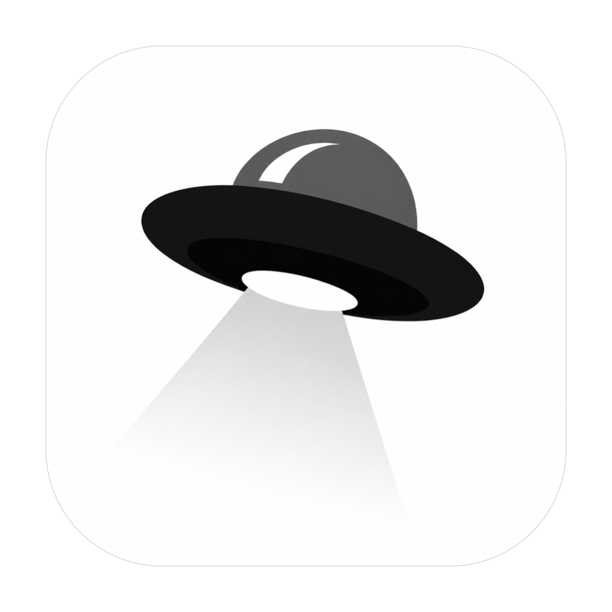
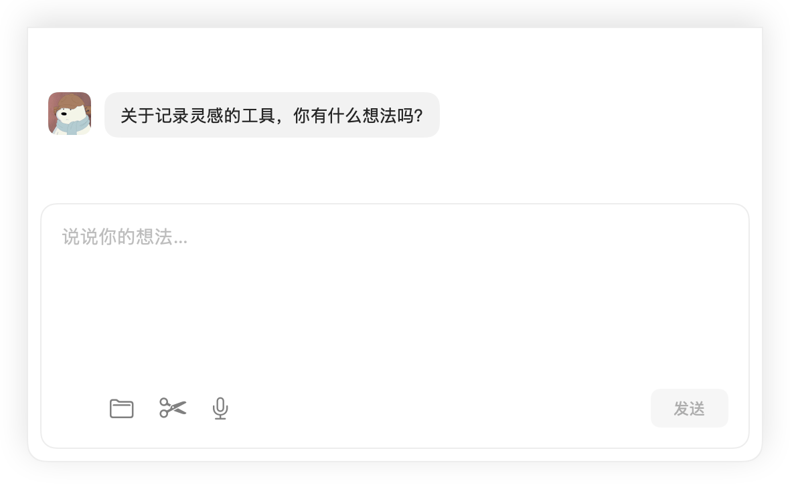
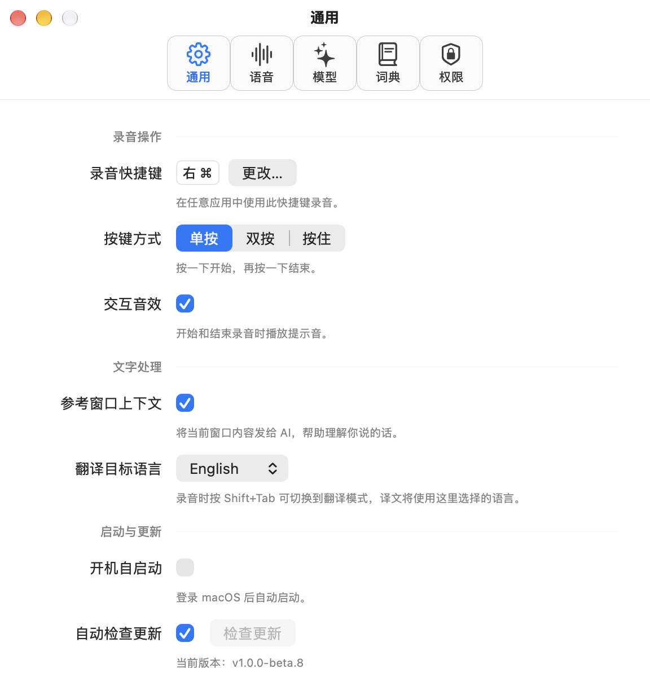
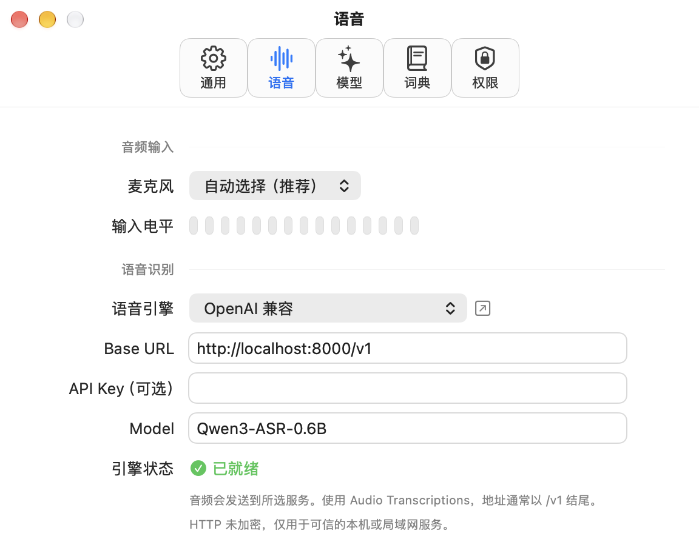
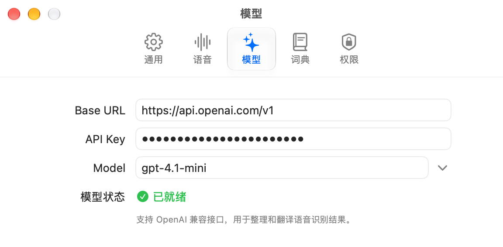
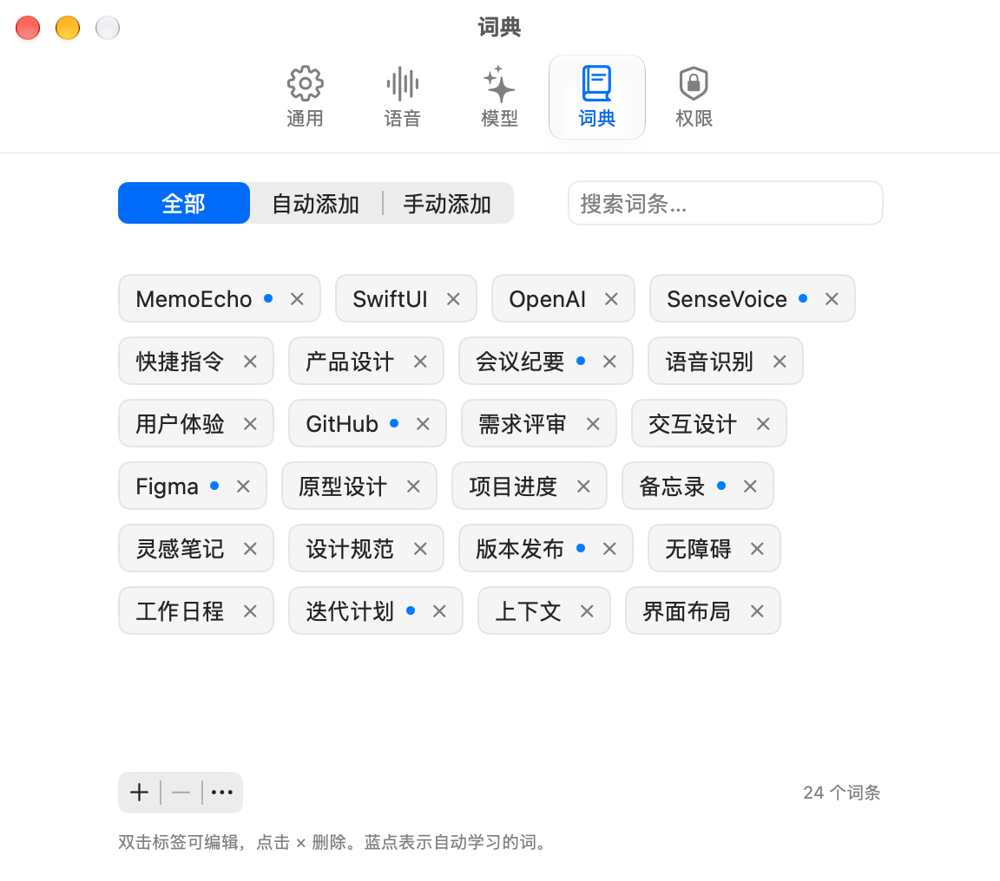

  

<h1 align="center">MemoEcho</h1>

多说话，少打字。

一款开源的 macOS AI 语音输入工具。

  <a href="https://memoecho.app">官网</a> ·
  <a href="https://github.com/isecret/MemoEcho/releases">版本下载</a> ·
  <a href="./docs/USAGE.md">使用说明</a>

## 用语音输入

聊天、写邮件或记笔记时，按一下快捷键开始说话，再按一下结束。MemoEcho 会去掉多余的口头语、整理断句，再把文字填入当前输入框。

  

需要用其他语言表达时，可以开启翻译。常用的人名、术语可以加入词典，MemoEcho 也会从你对输入结果的修改中学习用词。

语音识别可选本地模型或云端服务，文字整理和翻译使用你配置的 AI 服务。

## 界面一览

<table>
  <tr>
    <td align="center"> 通用设置</td>
    <td align="center"> 语音设置</td>
  </tr>
  <tr>
    <td align="center"> 模型设置</td>
    <td align="center"> 个人词典</td>
  </tr>
</table>
演示与截图使用示例内容。

## 开始使用

需要 **macOS 14 或更新版本**。当前为 **1.0.0-beta.3** 测试版。

首次打开时，按引导配置语音识别和 AI 服务，并允许访问麦克风和辅助功能。默认按 **右 Command** 开始或结束录音。

选择本地识别时，语音转文字在设备上完成，转写文字仍会发送给你配置的 AI 服务进行整理。「参考窗口上下文」默认开启，可在设置中关闭。应用不保存录音历史。

---

[开发与发布](./docs/DEVELOPMENT.md) · [产品说明](./docs/PRD.md) · [技术设计](./docs/TDD.md)
