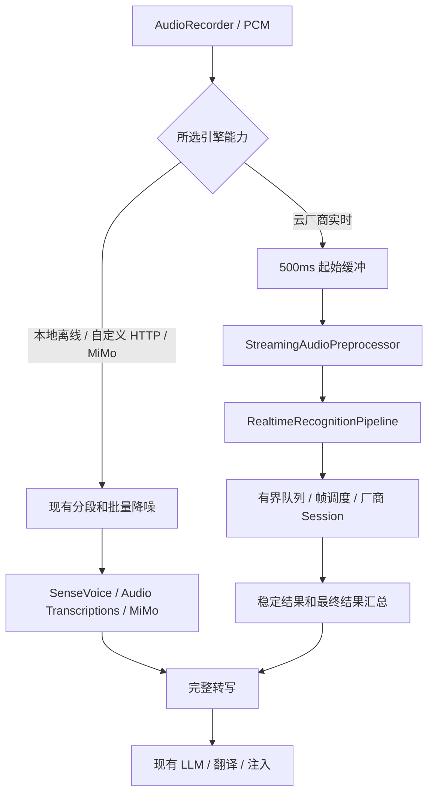

# 实时 ASR 方案

跟踪议题：[GitHub Issue #7：云厂商实时识别与 MiMo 独立适配](https://github.com/isecret/MemoEcho/issues/7)。

日期：2026-09-29；修订：2026-09-30。状态：实施中，已接入代码与合成协议测试，开发包构建已通过，真实服务验收尚未完成。云厂商专用入口下线一句话／文件识别，统一接入实时服务；本地 SenseVoice 离线识别保留。OpenAI 兼容收敛为 Audio Transcriptions；MiMo 以独立入口和适配器提供非实时识别。

## 1. 目标与推荐决策

让支持实时协议的云服务在用户讲话时接收音频并进行识别，减少停止录音后的等待。快捷键仍然是按一次开始、再按一次结束；最终转写齐全后才进入 LLM 润色／翻译，成功后统一注入。

云厂商专用入口采用替换方案：下线现有一句话／文件识别和录完后上传路径，不提供“分段／实时”切换，不将旧服务作为自动回退。腾讯云、阿里云、阿里云百炼、火山引擎、科大讯飞分别接入其连续音频实时服务。

实施优先使用长连接实时产品，不采用 IAT 短会话配合固定 55 秒轮换。首个适配器建议选火山大模型流式识别，随后接入腾讯实时、讯飞 RTASR、百炼实时和阿里云独立实时服务。具体会话生命周期、发送与接收、结果合并参考 OpenLess，协议细节仍须以官方文档和真实服务核验。

本地 SenseVoice 保留现有非流式识别能力、模型管理、取消与失败恢复，不要求换成流式模型，也不新增模拟流式解码。用户已将本次下线范围明确为云厂商服务，因此离线长录音现有的内部分段处理继续保留，不能误删公用 AudioSegmenter，也不改成无限缓存整次录音。

OpenAI 兼容属于自定义接入，收敛为 Audio Transcriptions，继续支持当前本地 Qwen3。Chat 音频识别从该入口移出，由独立的 MiMo 入口及适配器处理。MiMo 属于明确保留的非实时云服务例外，不纳入上述五个厂商入口的实时替换，也不按域名自动选择协议。

首个可发布版本必须同时完成流式降噪、长录音、失败恢复、配置验证和取消处理；不能仅以一个短音频 WebSocket demo 作为完成标准。

首版只在后台实时识别，HUD 保留现有录音和处理反馈。统一事件层接收 partial，但不将其写入目标输入框、不提前调用 LLM；实时文字预览可单独安排后续交付。

## 2. 已确认的事实与参考边界

### MemoEcho

- `AudioRecorder.startRecording(device:onPCMChunk:)` 已持续输出 16kHz、mono、PCM16，可以复用采集链路。
- 当前 `ASRProvider.recognize(audioData:timeout:)` 输入完整 WAV，只适用于批量结果。
- `SessionCoordinator` 目前串行消费 sealed segments，逐段降噪、识别，再拼接。已有 session generation、取消、注入保护和内存失败恢复。
- RNNoise 当前按完整 WAV 调用，内部 16k → 48k → RNNoise → 16k，每次重新建立降噪状态。直接逐块调用现有函数会反复重置状态，不能作为流式实现。
- 讯飞当前已用 WebSocket，但先收完整分段，再每 40ms 发送 1280 字节。改动重点是发送开始时间，而非单纯改用 WebSocket。
- 当前失败恢复最长保留 10 分钟，仅存在内存中；成功的分段释放对应音频。实时方案沿用这一期限。
- 2026-09-30 补充核验：当前 SenseVoiceSmall 是非流式模型，项目桥接使用 `SherpaOnnxOfflineRecognizer`。sherpa-onnx 提供 VAD 配合重复解码的模拟流式示例，但不能据此把该模型视为原生增量流式模型。本轮保留这一离线能力。[模型说明](https://k2-fsa.github.io/sherpa/onnx/rknn/models.html)、[模拟流式示例](https://github.com/k2-fsa/sherpa-onnx/blob/master/python-api-examples/simulate-streaming-sense-voice-microphone.py)

### OpenLess

参考版本固定为 `Open-Less/openless` 的 `beta` 提交 `5b39599486e3a0abe596fdb0dcc7451febaf9060`，避免跟随分支变化而失去依据。

- 借鉴会话式音频消费、异步连接期间的缓冲、发送与接收并行、partial/final 区分，以及厂商协议隔离。[会话源码](https://github.com/Open-Less/openless/blob/5b39599486e3a0abe596fdb0dcc7451febaf9060/openless-all/app/crates/openless-core/src/dictation_engine.rs)
- OpenLess 讯飞适配的是 RTASR，与本项目的 IAT 产品、鉴权和结果结构不同。其代码不能直接替换现有 Provider。[讯飞源码](https://github.com/Open-Less/openless/blob/5b39599486e3a0abe596fdb0dcc7451febaf9060/openless-all/app/crates/openless-core/src/asr/xfyun.rs)
- OpenLess 本地 Qwen3 的录音接入先缓存 PCM，停止后调用解码，不据此宣称本地 Qwen3 已支持连续音频实时识别。[本地接入源码](https://github.com/Open-Less/openless/blob/5b39599486e3a0abe596fdb0dcc7451febaf9060/openless-all/app/src-tauri/src/asr/local/local_provider.rs)
- 2026-09-30 补充查看 beta 源码：OpenLess 将 SenseVoice 标为 Offline，录音时缓存、停止后识别；流式 Zipformer 走独立 Online worker。该 sherpa 运行时主要接入 Windows，不能直接照搬为 MemoEcho 的 macOS 能力。[模型分类](https://github.com/Open-Less/openless/blob/beta/openless-all/app/crates/openless-core/src/local_asr_catalog.rs)、[本地 Provider](https://github.com/Open-Less/openless/blob/beta/openless-all/app/src-tauri/src/asr/local/sherpa_provider.rs)
- 本项目参考其按模型能力分流的设计。本轮保留 SenseVoice 现有长录音处理，不直接照搬“整次录音全部缓存到停止”的策略。
- 参考架构和可观察行为，在 MemoEcho 内独立实现 Swift 代码；不复制上游实现。

### 官方协议核对

- 讯飞 IAT 支持边上传边返回，单次最长 60 秒；动态修正可能替换先前结果，静音后端点可能让服务提前结束。[IAT 官方文档](https://www.xfyun.cn/doc/asr/voicedictation/API.html)
- RTASR 是另一项服务，需要独立核验授权，作为本次讯飞实时接入目标。[RTASR 官方文档](https://www.xfyun.cn/doc/asr/rtasr/API.html)
- 百炼 Inference WebSocket 必须等待 `task-started` 再发音频，发送 `finish-task` 后仍要等 `task-finished`。[百炼 WebSocket 文档](https://help.aliyun.com/zh/model-studio/fun-asr-realtime-websocket-api)
- 百炼的 Qwen Realtime 使用另一条事件协议，不能只换模型名复用 Inference 适配器。[Qwen Realtime 文档](https://help.aliyun.com/en/model-studio/qwen-asr-realtime-interaction-process)
- 火山和腾讯实时接口的存在与协议形状已由 OpenLess 源码确认；本次官方网页抓取未成功，精确时长、发送速率、鉴权组合、资源 ID、模型名须在各自实施阶段按官方文档和真实账户核验，不能把源码默认值当服务保证。[火山源码](https://github.com/Open-Less/openless/blob/5b39599486e3a0abe596fdb0dcc7451febaf9060/openless-all/app/crates/openless-core/src/asr/volcengine.rs)、[腾讯源码](https://github.com/Open-Less/openless/blob/5b39599486e3a0abe596fdb0dcc7451febaf9060/openless-all/app/crates/openless-core/src/asr/tencent_cloud.rs)

## 3. 服务与设置

设置页仅展示实际完成接入和验收的服务，不保留“识别方式”切换。厂商名称继续简洁展示；“阿里云”与“阿里云百炼”不能合并，也不增加“一句话”后缀。

| 引擎 | 新方案 |
| --- | --- |
| 本地 SenseVoice | 保留离线识别及现有长录音、模型管理和恢复行为 |
| 腾讯云 | 下线一句话识别，改接实时 WebSocket，配置其 AppID／模型 |
| 阿里云 | 保留独立入口，下线现有文件识别，接入其原生实时产品；实施前核验具体协议、授权与限制 |
| 阿里云百炼 | 下线当前非实时 DashScope HTTP；接入 Inference WebSocket 的已验证模型，Qwen Realtime 另行适配 |
| 火山引擎 | 下线文件识别，改接大模型流式识别 |
| 科大讯飞 | 下线当前整段上传路径，选择 RTASR；不再以 IAT 短会话轮换作为主方案 |
| OpenAI 兼容 | 仅 Audio Transcriptions，保留本地 Qwen3 等自定义服务，不宣称实时 |
| 小米 MiMo | 独立入口和适配器，按 MiMo Chat 音频协议进行非实时识别，不与 OpenAI 兼容混用 |

这里的“实时”要求持续上传音频。给现有 HTTP 接口加 `stream=true` 或接收 SSE，并不能证明其支持实时音频输入。

配置规则：

- 不新增 `recognitionMode`。旧服务的选择标识不静默映射到实时产品；检测到已下线服务时提示重新选择和配置，不能导致整个配置文件读取失败，也不能重置 LLM、词典或其他设置。
- 不同实时产品使用明确的配置类型。被替换云服务的旧就绪状态不能沿用；本地与自定义入口按原规则验证，凭据是否可复用按服务核验。本轮下线不等于已授权清除所有旧凭据，也不把此前“小米不迁移”的决定泛化到其他厂商。
- 腾讯实时服务增加其需要的 AppID；讯飞按 RTASR 重新配置和验证，不假定与 IAT 密钥或额度通用。
- 百炼实时使用显式 WSS endpoint，覆盖业务空间域名；不能把 HTTP endpoint 机械替换为 `wss`。模型只承诺已实现对应事件协议并完成联调的范围。
- 配置身份包含厂商、实时协议、endpoint、模型、资源和凭据；任何实际变化作废旧验证。原有平台级验证状态需要细化到配置身份。
- 设置页只展示所选服务需要的字段；分帧大小、超时、重试次数不暴露为用户高级参数。
- 就绪验证复用应用内的合成测试音频，按真实实时协议发送并取得完整非空结果；握手成功不能算就绪。页面说明测试会发送内置示例音频。
- 不自动回退厂商、旧接口或模型。MiMo 使用新独立配置，不兼容或迁移此前移除的两套小米配置，也不从 OpenAI 兼容配置中自动导入。

## 4. 数据链路与职责

### OpenAI 兼容入口的参考结论（2026-09-30）

核对 OpenLess beta 的 `provider_rules.rs` 和 `asr/whisper.rs`：通用 `openai-compatible` 路由到 WhisperCompatible 批量识别，默认使用 multipart `/audio/transcriptions`。录音期间缓存 PCM，停止后编码 WAV 并发起请求，不是实时音频链路。API Key 可空，空值不发送 Authorization；请求格式按 provider ID 决定，OpenRouter／ZenMux 的 JSON 是单独规则，不是通用入口自动探测。

它的通用入口默认不设分块时长，可通过高级配置设置；部分厂商则有专门分块限制。把 `/chat/completions` 地址改写成 `/audio/transcriptions` 只是 URL 规范化，不能证明支持 Chat 音频协议。其 MiMo 另有独立路由。

本项目按最新决定拆分：OpenAI 兼容仅负责 Audio Transcriptions；MiMo 独立负责 Chat 音频协议。移除通用入口的协议选择器，不照搬 URL 跨协议改写。当前本地 Qwen3 继续使用 Audio Transcriptions，长录音保留有界分段处理。MiMo 私有字段仅在其适配器内按官方契约处理，不泄漏进通用接口；不开放任意 JSON、Prompt 或通用实时高级设置。

来源：[批量请求实现](https://github.com/Open-Less/openless/blob/beta/openless-all/app/crates/openless-core/src/asr/whisper.rs)、[路由与能力规则](https://github.com/Open-Less/openless/blob/beta/openless-all/app/crates/openless-core/src/provider_rules.rs)。

### MiMo 独立适配（2026-09-30，已确认方向）

- 产品入口使用“小米 MiMo”。推荐一个独立入口，不按普通服务／Token Plan 复制两套适配器；地址可手动配置，实际套餐地址和模型必须分别验证。此为具体落地建议，不表示恢复历史两个入口。
- 新建 `MiMoASRProvider`、`MiMoASRConfig`、独立平台标识与表单；建议新标识 `mimoASR`、配置键 `asr.mimo`，避免重新消费已移除的小米旧键。配置包含 Base URL、API Key、Model，验证状态按 MiMo 自身身份记录。
- 适配器负责 `/chat/completions` 音频请求、MiMo 所需字段、结果解析、错误和超时；实施前复核官方协议，不因名字相同直接恢复已删除代码。验证使用合成语音，只有取得有效最终转写才就绪。
- `OpenAICompatibleASRProvider` 删除 Chat 编码与解析分支，设置页移除协议下拉框，只支持 `/audio/transcriptions` 的 multipart WAV 请求。当前 Audio Transcriptions 配置继续有效；若残留 `apiFormat=chatCompletions`，提示该方式已移出且需要手动配置 MiMo，不自动按 Audio Transcriptions 发出请求、不自动搬运 Key。
- MiMo 不读取或迁移历史 `xiaomiMiMo`／`xiaomiMiMoTokenPlan`，也不将它们的验证状态恢复。配置项之间不能互相覆盖；非相关 LLM、词典和其他有效设置保持独立。
- MiMo、OpenAI 兼容、LLM 即便共享 HTTP 工具，也分别持有配置和协议对象，不共用 Key、模型或就绪状态，不自动 fallback。
- 验收覆盖 MiMo 请求契约、两入口隔离、缺失凭据、服务异常、取消、迟到响应、历史数据不导入，以及当前本地 Qwen3 的回归。未提供真实 MiMo 验收结果前，仅报告协议测试状态。

### 主链路

按所选引擎的固定能力选择处理路径，不给同一云厂商保留新旧模式切换。



建议新增模块：

| 模块 | 职责 |
| --- | --- |
| `RealtimeASRProvider` / `RealtimeASRSession` | 新建单次识别任务，管理 connect、send、finish、cancel 与事件流 |
| `RealtimeRecognitionPipeline` | 实时窗口、PCM 顺序、有界缓冲、会话收尾和恢复材料；对 Coordinator 提供完整转写 |
| `StreamingAudioPreprocessor` | 会话内持续的 RNNoise 状态、重采样残余、尾帧 flush |
| `RealtimeTranscriptAccumulator` | 稳定窗口排序；厂商内部修正由适配器完成后提供标准化快照 |
| `RealtimeASRCapabilities` | PCM 格式、帧大小、发送节奏、窗口和静音限制、完成语义 |
| `WebSocketTransport` | 可注入的连接、发送、接收和关闭能力，供真实实现和测试替身使用 |

工厂对五个已列明的实时厂商入口创建实时引擎，移除它们旧的一句话／文件 Provider 分派；对 SenseVoice、OpenAI 兼容和 MiMo 创建各自的非流式 `ASRProvider`。Coordinator 选择对应流水线，实时链路不进入 sealed-segment 请求队列，原队列仅供保留的非实时引擎使用。厂商帧格式留在适配器，不在 Coordinator 中逐家判断。

实时会话接口草图：

```swift
protocol RealtimeASRSession: Sendable {
    var events: AsyncThrowingStream<RealtimeASREvent, Error> { get }
    func connect() async throws
    func send(_ frame: PCMFrame) async throws
    func finish() async throws -> TranscriptResult
    func cancel() async
}
```

接口约定比名称更重要：connect 以协议可发送为完成点；send 由唯一写入任务调用；finish 只成功一次，等待服务端最终完成；cancel 幂等，立即关闭连接并解除所有挂起等待。事件流有且只有一个消费者，错误和 finish 竞争时只产生一次终态。partial 可合并为最新快照，错误／最终完成不可因缓冲策略被丢弃。

会话内部状态：`idle → connecting → streaming → draining → finished`，任意非终态可进入 `failed/cancelled`。对外录音期间仍是 recording，停止后进入现有处理状态。所有异步结果携带 session generation 和 window ID，过期结果不能回写或注入。

## 5. 音频、窗口和资源边界

### 5.1 起始和短录音

- 前 500ms 只进入内存起始缓冲，不执行降噪、不建立识别任务、不发送用户音频；达到阈值后开始流式链路并补发起始音频。
- 短于 500ms 时沿用静默取消；500ms 阈值引入的固定起始延迟是明确取舍。
- 采集回调仅进行有界入队，不等待网络、不在音频回调中跑 RNNoise、不为每块创建无界 Task。
- 网络连接期间继续缓冲。发送节奏以实际采样时间和厂商约束为依据；不能按实时采集节奏等一遍、每次 send 再多等一遍。对要求实时速率的服务，起始和连接积压可能持续到停止后，指标需要如实记录。

### 5.2 流式降噪

- 一个用户录音会话持有一个 RNNoise 状态，按 48kHz／480 samples 的 10ms 帧处理。重采样保留跨 chunk 的插值状态，不能每块重复末端样本。
- 停止时 flush 残余；必要的补零只用于内部算法处理，输出裁剪回真实采样数，并验证算法延迟没有截掉句尾。
- 云端继续接收 16kHz PCM16。网络窗口轮换不重置连续降噪状态。
- 当前批量链路在降噪失败时回退原音频，尽管预处理器注释称不回退。实时路径拟沿用该实际行为：只对尚未提交的当前帧起切换到原 PCM，记录一次固定错误码，不能重复发送已处理的帧；在实施时将这一行为写入 TDD。

### 5.3 实时窗口与长录音

正常录音使用一个持续的实时任务，按厂商要求发送小帧，服务端返回句子结果。网络分帧不等于原来“攒一段 WAV 后再识别”。云厂商实时路径不再使用原 15 秒最小段长、55 秒强制切段和逐段请求队列，不用 IAT 的短会话限制重新制造同一套流程。这些现有规则保留于本地／自定义／MiMo 非实时路径；MiMo 的单请求音频上限还需按官方契约核验，不能无条件假设接受 55 秒。

- 用户短暂停顿不默认结束并重开识别请求；按实时服务协议处理静音和句子结束。只有服务协议要求、达到其已核验会话上限或资源边界时才处理任务轮换。
- App 不设置固定录音时长上限；厂商的单连接／单任务限制必须显式记录。必要的长会话续接是协议生命周期处理，不回退一句话服务。
- 会话续接采用唯一采样序号和明确提交边界，禁止音频遗漏、重复转写以及按文本相似度盲目去重。需要并发预连接时最多两路，先核验账户配额；不能再建议用户退回已经下线的分段模式。
- 只有确认不可撤回、并具有可靠音频覆盖边界的最终结果，才可释放对应恢复音频；收到 partial 或发送完成不等于服务端已确认识别。
- 接入前必须验证服务的稳定结果边界、时间戳与完成语义。若不能安全确定恢复边界，需要设计服务原生的有限任务检查点及续接，不能无限缓存整次录音，也不能假称已解决无限时长恢复。
- 初始待发送队列预算为 15 秒 PCM（480,000 字节）；恢复音频预算暂定 120 秒 PCM（3,840,000 字节）。这是内存预算，不是自动停止录音的正常时长上限。稳定结果应持续释放旧音频；超预算说明连接或确认进度异常，明确失败并保留现有有效材料，不偷偷丢帧。
- 在正常长录音测试中必须证明音频内存不随录音时长线性增长；达不到这一点的服务适配器不能通过验收。持续静音也需覆盖，必要时按协议结束空任务，后续讲话重新开始。
- 云端实时链路禁用 AudioRecorder 的整次录音副本，停止结果以采样数／时长／采集状态判断有效性，不能继续使用“完整 WAV 为空即失败”的判断。
- 服务提前结束且无法证明已覆盖所发音频时，按失败保留材料，不静默丢尾部。不同厂商的续接与内存释放方案在适配器实施前形成协议验收记录。

### 5.4 停止与文本结果

停止顺序固定为：关闭采集并等待最后回调屏障 → flush 降噪 → 排空已接收帧 → 发协议结束标记 → 等厂商任务完成 → 合并窗口最终文本 → 检查 8000 字符 → LLM。

- 后续窗口中的短尾音频属于已经有效的同一次录音，不重复应用整次 500ms 误触规则，也不强制达到 15 秒。
- partial 不可直接追加成最终文本。适配器按厂商句子 ID、序号、替换区间或全量快照处理修正，再发标准化事件。
- 句子 final 不等于任务完成；连接关闭也不天然等于成功。只有适配器识别到完整的协议完成条件才提交窗口。
- 有效语音窗口结果为空则失败；确认没有语音的静音窗口可跳过。任一有效窗口失败，不提交成功前缀给 LLM。
- 8000 字符按确认的最终文本检查，partial 来回修正不累计计数。

## 6. 超时、失败与恢复

云厂商实时路径不再使用旧分段请求的动态超时公式；本地／自定义／MiMo 路径使用有界的批量请求超时。实时路径分别计时，建议内部初值：连接及协议启动合计 8 秒；单帧发送最长 5 秒；末帧和结束标记发出后的最终结果等待 15 秒。等待任务准备、队列积压和服务时长另有上限。以上需通过弱网实测校准，不是新增设置项。

录音中没有 partial，可能只是用户静音，不能直接触发“识别超时”。连接存活、发送阻塞和厂商协议心跳分开处理；不插入伪造音频维持连接。

失败策略：

1. 握手、鉴权或资源权限失败：停止当前录音，给出对应错误，不自动换服务。
2. 已经发送音频后断线：首版不自动重连重放，不把旧 partial 合并到新结果。
3. 取消：停采集、关连接、取消定时器和降噪任务、清内存，迟到结果无效。
4. 用户主动重试：使用同一厂商、同一实时协议的当前有效配置，新建任务完整重放失败窗口，按协议限速；替换整个失败窗口结果，不与其旧 partial 拼接。
5. 已成功提交的窗口只保留文本；未成功的窗口和录音停止前有界缓冲的尾部保存在内存。实时失败保留可直接重放的已处理 PCM，不能再次降噪。处理队列尚未完成的原 PCM 需标注处理状态，恢复时只处理一次。
6. 只有识别全部完成才进入现有 LLM／翻译／注入恢复流程，注入后的重复写入保护继续生效。

`SessionRecoveryCheckpoint` 改为记录实时协议、稳定提交边界和音频处理状态，不能仅凭旧 `asrPlatform` 和 WAV 闭包重试。实时恢复不调用已下线的一句话服务；从最后可靠提交边界重放未确认部分，最终结果不能与旧 partial 重复拼接。本地／自定义／MiMo 保留分段恢复材料，使用明确的非实时／实时类型区分，避免重试时误调用另一类服务。

恢复材料沿用首次失败起 10 分钟到期、重试不续期、取消或丢弃即清理的规则；不写音频历史，不延长现有日志保留期。试用窗口仍不参与跨会话恢复。纯误触、没有有效音频、用户取消和超长文本不创建恢复记录。

## 7. 诊断和性能验收

实时请求横跨录音过程，不能用“连接开始到结束”的总时间与原来的录后 HTTP 耗时直接比较。

新增白名单指标：`connect_ms`、`protocol_ready_ms`、`first_audio_sent_ms`、`first_partial_ms`（可空）、`queued_audio_ms_peak`、`drain_after_stop_ms`、`final_after_end_ms`、`asr_wait_after_stop_ms`、`window_count`、`recovery_attempt`、`stop_to_injection_ms`。分别记录快捷键停止请求与实际采集关闭时刻，避免现有 100ms End 提示音延迟混入错误阶段。

只记录时长、计数、平台／协议枚举、状态码和随机会话标识。新增实时日志在 Debug／Release 都不记录音频、partial、final、签名 URL、Authorization 或用户配置 endpoint；现有日志隐私规则不得因联调而放宽。

对比方法：

- 使用仓库允许的合成或公开测试音频，按真实时间喂入，测试 3s、10s、30s、55s、超过 60s／120s，以及长静音后继续讲话。
- 旧版安装包或独立测试基线用于比较，不在新产品的云厂商入口保留分段模式。相同模型能比较时控制模型和网络；改用不同实时产品时明确标注，不能归因于发送方式一个因素。
- 每个短音频档至少 20 对；报告均值、中位数、P95、失败率、未完成请求数。长录音以边界正确性为主。冷连接和已验证配置分开标记，不排除失败样本制造速度改善。
- 首期报告新实时链路相对旧版的录后等待、P95、失败率和 CER。撤回原“讯飞 IAT 同服务至少提速 50%”的门槛：新的首发服务与旧服务不同，性能门槛需以首个真实基线制定，不承诺必然快于原来所有引擎。
- 准确性用同一参考文本计算 CER，并检查首字、尾字、专有词和窗口边界。只有速度改善但漏字的版本不通过验收。
- 单独报告 LLM 与注入时间。当前本地 Qwen3 的短请求已约 0.40s，不能承诺实时云服务必然比它更快。

## 8. 测试清单

| 层次 | 必测内容 |
| --- | --- |
| 流式预处理 | 任意 chunk 大小、奇数样本边界、跨帧连续性、flush、真实采样数、算法延迟、降噪故障切换不重复音频 |
| 音频队列 | 单写入者、采样顺序、连接期间缓冲、限速、慢发送、积压超限、取消解锁、无每帧 Task 泄漏 |
| 厂商适配器 | 鉴权／未开通、ready 握手、首中尾帧、追加／替换／重复结果、句子 final 与任务完成、缺少 final 的异常关闭 |
| Coordinator | 499ms 静默取消且零上传、500ms 有效、录音中与停止后的错误、快速启停、旧代次消息、配置变化、翻译和试用路径 |
| 长录音 | 跨越原 55s 边界不断流、120s／10min 连续录音、厂商原生时长边界续接、长停顿再说、纯静音、低音量首字、尾部采样不丢、内存有界 |
| 恢复 | 成功窗口不重跑、失败窗口完整替换、不重复降噪、配置身份、到期、重复重试、恢复时取消、不注入部分文本 |
| 配置 | 旧服务标识引导重新配置且其他设置不丢、HTTP 验证不能沿用、实时产品独立验证、WSS endpoint 与模型不匹配、已下线入口不可选 |
| 回归 | 无旧云端 Provider 调用／回退、8000 字符限制、LLM 失败不注入、注入失败恢复和剪贴板行为；SenseVoice、Audio Transcriptions、MiMo 的就绪、长录音、取消和恢复分别回归；校验通用入口无 Chat 请求、MiMo 不调用转写文件接口 |

厂商解析采用合成消息 fixture；网络状态和超时采用可控 transport／clock，避免纯 sleep 测试。自动化通过后，在 MemoEcho Dev 中用用户自行配置的凭据做真实录音验收；不把真实语音、文本和凭据放进测试仓库。

## 9. 交付顺序与修改范围

| 阶段 | 交付 | 退出条件 |
| --- | --- | --- |
| M1：基础与火山实时 | 云端实时工厂、流式降噪、有界队列、稳定结果合并、配置和恢复、诊断 | 自动化通过；短句／长静音／10min／取消／恢复通过真实应用验收；有同音频对照数据 |
| M2：扩展覆盖 | 腾讯实时、讯飞 RTASR、百炼 Inference、阿里云独立实时服务，各自完成适配 | 各自鉴权、时长、静音、结果确认边界和资源限制得到验证 |
| M3：统一切换发布 | 替换五家实时厂商的旧实现；独立 MiMo 并收敛 OpenAI 兼容，保留本地流水线，完成配置引导 | 五个实时入口及 SenseVoice、Audio Transcriptions、MiMo 分别通过真实录音验收；无旧云厂商接口调用 |
| 后续候选 | 百炼 Qwen Realtime、HUD 文字预览、ASR 热词、本地流式模型 | 独立扩展，不作为保留 SenseVoice 或当前本地 Qwen3 的前提 |

开发可按阶段进行，正式切换版本不同时保留新旧云端模式。若先发布只有部分厂商的测试包，明确标注已接入范围，不声称厂商覆盖已经齐全。

涉及文件集中在 `Providers` 的实时协议与适配器、`Domain/Services` 的流水线和恢复模型、`Platform` 的流式降噪与录音停止屏障、Coordinator 的按能力分流，以及 ASR 配置、设置、验证和诊断。LLM Provider 与 TextInjector 的业务行为不改。

用户已确认云厂商统一实时、本地离线保留；实现已移除旧云厂商批量 Provider，保留非实时入口。按该范围同步更新 `docs/PRD.md`、`docs/TDD.md`、`docs/EPICS_AND_STORIES.md`、`docs/USAGE.md`、`docs/validation-e2e.md` 和 `AGENTS.md` 的旧约束。文档区分五个厂商实时入口与 SenseVoice／Audio Transcriptions／MiMo 非实时入口，不能把“所有云端 ASR 必须实时”或“OpenAI 兼容支持 Chat 音频”继续作为新版本约束。


## 10. 实施记录（2026-09-30）

- 五个云厂商入口改走独立实时会话；MiMo 使用新配置，OpenAI 兼容仅 Audio Transcriptions。旧云端批量 Provider 已移除。
- 本轮采用 90 秒原生任务检查点，只在完整任务确认后释放音频；不根据 partial 或未经核验的句子时间戳释放恢复材料。录音本身不限制时长。
- 腾讯／讯飞的发送节奏要求实时速率，任务交接需要提前连接、前窗异步收尾与最多两个任务的并发上限。真实账户连接配额、长静音和连续讲话边界必须单独验收。
- 开发包已通过完整 Xcode 构建和本机签名校验；宿主 XCTest 及真实服务验收仍未完成。具体测试范围与待办见 [实时 ASR 验证记录](../validation-realtime-asr.md)。
